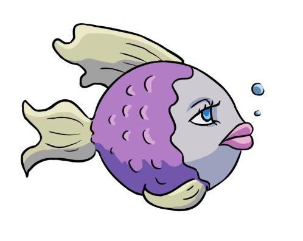
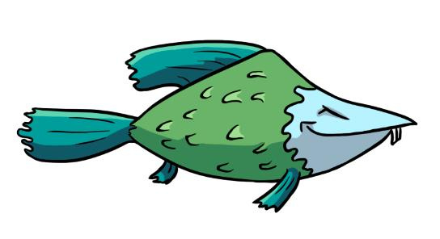
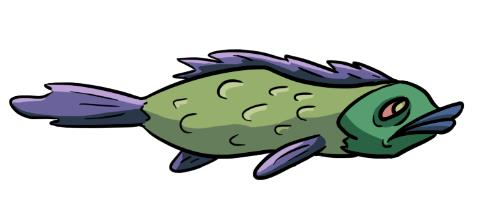

# aquaworld_source
<strong> Здесь содержится исходный код игры Aquaworld: от малька до акулы </strong>  
Приложение создано в Unity3D.
Описание игры:

Игра «Аквамир: от малька до акулы» относится к жанру Аркада с элементами RPG. 
Реализована в двухмерном пространстве с видом сбоку, с использованием графического интерфейса. 
Цель игры: пройти все уровни, набрав наибольшее количество очков. 
При запуске игры после заставки отображается меню, состоящее из следующих пунктов: Начать игру, помощь, рекорды,  настройки и выйти. 
При нажатии на кнопку «Начать игру» предоставляется выбор: продолжить сохраненную игру или начать новую. При старте новой игры пользователю  предоставляется выбор между тремя разными рыбами, которые отличаются внешним видом, а также особым умением. 
  Набор персонажей: 
  <ul>
    <li>
      Настя 
      
    </li>
    <li>
      Гин 
      
    </li>
    <li>
      Гоша 
      
    </li>
  </ul>
  После выбора персонажа, а затем и выбора уровня начинается сам игровой процесс.
Рыбка игрока находится на поле, представляющем собой море.  Внизу поля располагается дно, сверху – поверхность воды, по бокам поле ограничено скалами.
Экран пользователя имеет следующий вид: рыбка располагается в центре. Количество жизней, общий игровой счёт и активные бонусы должны располагаться в правом верхнем углу. По центру сверху экрана располагается счётчик времени, в левом нижнем должны быть задания на текущий уровень, время до перезарядки умения, в центре снизу – рыба, которую может съесть игрок. В правом нижнем углу – миникарта. 
 
Управление героем осуществляется направлением курсора мыши – куда он указывает, в ту сторону и плывёт рыбка игрока. 
Вместе с игроком под водой плавает еще много других рыб, управляемых компьютером, как меньше размером, так и больше, чем рыба игрока (не обязательно). 
Игрок способен поглотить рыб, меньших его по размеру, наплывая на них. При этом происходит увеличение размера рыбы игрока. Если же игрока настигает рыба большая по размеру, чем герой, то игрок теряет одну жизнь. Потеряв все жизни, игроку придётся начинать уровень заново. 
Игра состоит из десяти уровней. Задание на каждый из них следующее: игрок должен съесть указанное количество рыб, изображенных на рисунке и доступных для пользователя на игровом поле. Для удобства количество рыбы одного вида в задании не должно превышать 20. За каждую съеденную рыбу игрок получает очки в зависимости от её размера. За быстрое прохождение уровня игрок также будет получать дополнительные очки. Набрав определенное количество очков игрок повышает свой уровень, улучшая свой особый навык и увеличивая количество жизней. 
Кроме того, в игре присутствуют различные плавающие бонусы, например, удваивающие количество очков, засчитывающих необходимую по заданию рыбу, прибавляющие очки и др. 
 
